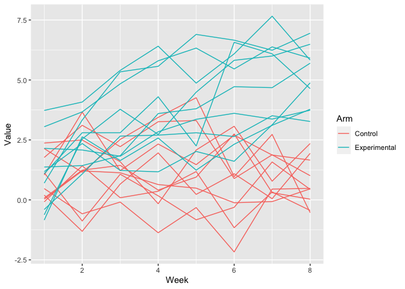
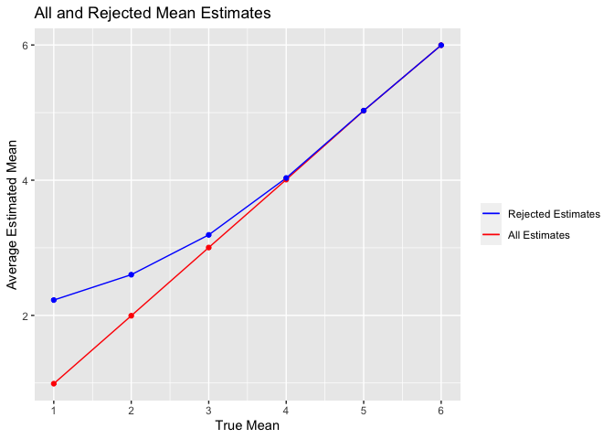

Homework 5
================
Ekaterina Hofrenning
2023-11-02

``` r
library(tidyverse)
library(purrr)
library(broom)
```

# Problem 1

The Washington Post has gathered data on homicides in 50 large U.S.
cities and made the data available through a GitHub repository here. You
can read their accompanying article here.

Describe the raw data. Create a city_state variable (e.g. “Baltimore,
MD”) and then summarize within cities to obtain the total number of
homicides and the number of unsolved homicides (those for which the
disposition is “Closed without arrest” or “Open/No arrest”).

``` r
homicide <- read_csv("data/q1/homicide-data.csv") %>%
  mutate(city_state = str_c(city, state, sep = ", "),
         unsolved_homicides = disposition %in% c("Closed without arrest", "Open/No arrest"))
```

``` r
homicide %>%
  group_by(city_state) %>%
  summarize(total_homicides = n(),
            unsolved_homicides = sum(unsolved_homicides== T)) %>%
  kableExtra::kable()
```

<table>
<thead>
<tr>
<th style="text-align:left;">
city_state
</th>
<th style="text-align:right;">
total_homicides
</th>
<th style="text-align:right;">
unsolved_homicides
</th>
</tr>
</thead>
<tbody>
<tr>
<td style="text-align:left;">
Albuquerque, NM
</td>
<td style="text-align:right;">
378
</td>
<td style="text-align:right;">
146
</td>
</tr>
<tr>
<td style="text-align:left;">
Atlanta, GA
</td>
<td style="text-align:right;">
973
</td>
<td style="text-align:right;">
373
</td>
</tr>
<tr>
<td style="text-align:left;">
Baltimore, MD
</td>
<td style="text-align:right;">
2827
</td>
<td style="text-align:right;">
1825
</td>
</tr>
<tr>
<td style="text-align:left;">
Baton Rouge, LA
</td>
<td style="text-align:right;">
424
</td>
<td style="text-align:right;">
196
</td>
</tr>
<tr>
<td style="text-align:left;">
Birmingham, AL
</td>
<td style="text-align:right;">
800
</td>
<td style="text-align:right;">
347
</td>
</tr>
<tr>
<td style="text-align:left;">
Boston, MA
</td>
<td style="text-align:right;">
614
</td>
<td style="text-align:right;">
310
</td>
</tr>
<tr>
<td style="text-align:left;">
Buffalo, NY
</td>
<td style="text-align:right;">
521
</td>
<td style="text-align:right;">
319
</td>
</tr>
<tr>
<td style="text-align:left;">
Charlotte, NC
</td>
<td style="text-align:right;">
687
</td>
<td style="text-align:right;">
206
</td>
</tr>
<tr>
<td style="text-align:left;">
Chicago, IL
</td>
<td style="text-align:right;">
5535
</td>
<td style="text-align:right;">
4073
</td>
</tr>
<tr>
<td style="text-align:left;">
Cincinnati, OH
</td>
<td style="text-align:right;">
694
</td>
<td style="text-align:right;">
309
</td>
</tr>
<tr>
<td style="text-align:left;">
Columbus, OH
</td>
<td style="text-align:right;">
1084
</td>
<td style="text-align:right;">
575
</td>
</tr>
<tr>
<td style="text-align:left;">
Dallas, TX
</td>
<td style="text-align:right;">
1567
</td>
<td style="text-align:right;">
754
</td>
</tr>
<tr>
<td style="text-align:left;">
Denver, CO
</td>
<td style="text-align:right;">
312
</td>
<td style="text-align:right;">
169
</td>
</tr>
<tr>
<td style="text-align:left;">
Detroit, MI
</td>
<td style="text-align:right;">
2519
</td>
<td style="text-align:right;">
1482
</td>
</tr>
<tr>
<td style="text-align:left;">
Durham, NC
</td>
<td style="text-align:right;">
276
</td>
<td style="text-align:right;">
101
</td>
</tr>
<tr>
<td style="text-align:left;">
Fort Worth, TX
</td>
<td style="text-align:right;">
549
</td>
<td style="text-align:right;">
255
</td>
</tr>
<tr>
<td style="text-align:left;">
Fresno, CA
</td>
<td style="text-align:right;">
487
</td>
<td style="text-align:right;">
169
</td>
</tr>
<tr>
<td style="text-align:left;">
Houston, TX
</td>
<td style="text-align:right;">
2942
</td>
<td style="text-align:right;">
1493
</td>
</tr>
<tr>
<td style="text-align:left;">
Indianapolis, IN
</td>
<td style="text-align:right;">
1322
</td>
<td style="text-align:right;">
594
</td>
</tr>
<tr>
<td style="text-align:left;">
Jacksonville, FL
</td>
<td style="text-align:right;">
1168
</td>
<td style="text-align:right;">
597
</td>
</tr>
<tr>
<td style="text-align:left;">
Kansas City, MO
</td>
<td style="text-align:right;">
1190
</td>
<td style="text-align:right;">
486
</td>
</tr>
<tr>
<td style="text-align:left;">
Las Vegas, NV
</td>
<td style="text-align:right;">
1381
</td>
<td style="text-align:right;">
572
</td>
</tr>
<tr>
<td style="text-align:left;">
Long Beach, CA
</td>
<td style="text-align:right;">
378
</td>
<td style="text-align:right;">
156
</td>
</tr>
<tr>
<td style="text-align:left;">
Los Angeles, CA
</td>
<td style="text-align:right;">
2257
</td>
<td style="text-align:right;">
1106
</td>
</tr>
<tr>
<td style="text-align:left;">
Louisville, KY
</td>
<td style="text-align:right;">
576
</td>
<td style="text-align:right;">
261
</td>
</tr>
<tr>
<td style="text-align:left;">
Memphis, TN
</td>
<td style="text-align:right;">
1514
</td>
<td style="text-align:right;">
483
</td>
</tr>
<tr>
<td style="text-align:left;">
Miami, FL
</td>
<td style="text-align:right;">
744
</td>
<td style="text-align:right;">
450
</td>
</tr>
<tr>
<td style="text-align:left;">
Milwaukee, wI
</td>
<td style="text-align:right;">
1115
</td>
<td style="text-align:right;">
403
</td>
</tr>
<tr>
<td style="text-align:left;">
Minneapolis, MN
</td>
<td style="text-align:right;">
366
</td>
<td style="text-align:right;">
187
</td>
</tr>
<tr>
<td style="text-align:left;">
Nashville, TN
</td>
<td style="text-align:right;">
767
</td>
<td style="text-align:right;">
278
</td>
</tr>
<tr>
<td style="text-align:left;">
New Orleans, LA
</td>
<td style="text-align:right;">
1434
</td>
<td style="text-align:right;">
930
</td>
</tr>
<tr>
<td style="text-align:left;">
New York, NY
</td>
<td style="text-align:right;">
627
</td>
<td style="text-align:right;">
243
</td>
</tr>
<tr>
<td style="text-align:left;">
Oakland, CA
</td>
<td style="text-align:right;">
947
</td>
<td style="text-align:right;">
508
</td>
</tr>
<tr>
<td style="text-align:left;">
Oklahoma City, OK
</td>
<td style="text-align:right;">
672
</td>
<td style="text-align:right;">
326
</td>
</tr>
<tr>
<td style="text-align:left;">
Omaha, NE
</td>
<td style="text-align:right;">
409
</td>
<td style="text-align:right;">
169
</td>
</tr>
<tr>
<td style="text-align:left;">
Philadelphia, PA
</td>
<td style="text-align:right;">
3037
</td>
<td style="text-align:right;">
1360
</td>
</tr>
<tr>
<td style="text-align:left;">
Phoenix, AZ
</td>
<td style="text-align:right;">
914
</td>
<td style="text-align:right;">
504
</td>
</tr>
<tr>
<td style="text-align:left;">
Pittsburgh, PA
</td>
<td style="text-align:right;">
631
</td>
<td style="text-align:right;">
337
</td>
</tr>
<tr>
<td style="text-align:left;">
Richmond, VA
</td>
<td style="text-align:right;">
429
</td>
<td style="text-align:right;">
113
</td>
</tr>
<tr>
<td style="text-align:left;">
Sacramento, CA
</td>
<td style="text-align:right;">
376
</td>
<td style="text-align:right;">
139
</td>
</tr>
<tr>
<td style="text-align:left;">
San Antonio, TX
</td>
<td style="text-align:right;">
833
</td>
<td style="text-align:right;">
357
</td>
</tr>
<tr>
<td style="text-align:left;">
San Bernardino, CA
</td>
<td style="text-align:right;">
275
</td>
<td style="text-align:right;">
170
</td>
</tr>
<tr>
<td style="text-align:left;">
San Diego, CA
</td>
<td style="text-align:right;">
461
</td>
<td style="text-align:right;">
175
</td>
</tr>
<tr>
<td style="text-align:left;">
San Francisco, CA
</td>
<td style="text-align:right;">
663
</td>
<td style="text-align:right;">
336
</td>
</tr>
<tr>
<td style="text-align:left;">
Savannah, GA
</td>
<td style="text-align:right;">
246
</td>
<td style="text-align:right;">
115
</td>
</tr>
<tr>
<td style="text-align:left;">
St. Louis, MO
</td>
<td style="text-align:right;">
1677
</td>
<td style="text-align:right;">
905
</td>
</tr>
<tr>
<td style="text-align:left;">
Stockton, CA
</td>
<td style="text-align:right;">
444
</td>
<td style="text-align:right;">
266
</td>
</tr>
<tr>
<td style="text-align:left;">
Tampa, FL
</td>
<td style="text-align:right;">
208
</td>
<td style="text-align:right;">
95
</td>
</tr>
<tr>
<td style="text-align:left;">
Tulsa, AL
</td>
<td style="text-align:right;">
1
</td>
<td style="text-align:right;">
0
</td>
</tr>
<tr>
<td style="text-align:left;">
Tulsa, OK
</td>
<td style="text-align:right;">
583
</td>
<td style="text-align:right;">
193
</td>
</tr>
<tr>
<td style="text-align:left;">
Washington, DC
</td>
<td style="text-align:right;">
1345
</td>
<td style="text-align:right;">
589
</td>
</tr>
</tbody>
</table>

For the city of Baltimore, MD, use the prop.test function to estimate
the proportion of homicides that are unsolved; save the output of
prop.test as an R object, apply the broom::tidy to this object and pull
the estimated proportion and confidence intervals from the resulting
tidy dataframe.

Now run prop.test for each of the cities in your dataset, and extract
both the proportion of unsolved homicides and the confidence interval
for each. Do this within a “tidy” pipeline, making use of purrr::map,
purrr::map2, list columns and unnest as necessary to create a tidy
dataframe with estimated proportions and CIs for each city.

Create a plot that shows the estimates and CIs for each city – check out
geom_errorbar for a way to add error bars based on the upper and lower
limits. Organize cities according to the proportion of unsolved
homicides.

# Problem 2

This zip file contains data from a longitudinal study that included a
control arm and an experimental arm. Data for each participant is
included in a separate file, and file names include the subject ID and
arm. Create a tidy dataframe containing data from all participants,
including the subject ID, arm, and observations over time:

- Start with a dataframe containing all file names; the list.files
  function will help
- Iterate over file names and read in data for each subject using
  purrr::map and saving the result as a new variable in the dataframe
- Tidy the result; manipulate file names to include control arm and
  subject ID, make sure weekly observations are “tidy”, and do any other
  tidying that’s necessary
- Make a spaghetti plot showing observations on each subject over time,
  and comment on differences between groups.

``` r
sets <- list.files("data/q2", full.names = T)

files <- purrr::map(sets, read_csv) %>% 
  bind_rows() %>%
  mutate(control_arm = as.factor(if_else(row_number() %in% c(1:10), "Control", "Experimental")),
         ID = row_number()) %>%
  relocate(control_arm, ID, .before = "week_1") %>%
  pivot_longer(cols = week_1:week_8, names_to = "week", values_to = "value") %>%
  separate(week, c("text", "week")) %>%
  mutate(week = as.integer(week)) %>%
  select(-text)
```

``` r
ggplot(files, aes(x = week, y = value, group = ID, color = control_arm)) +
  geom_line() +
  labs(x = "Week", y = "Value", color = "Arm")
```

<!-- -->

As seen in the plot above, the experimental arm has a higher average
value than the control arm. Additionally, the experimental arm’s values
rise as the weeks go on, whereas the control arms appear steady on
average.

# Problem 3

When designing an experiment or analysis, a common question is whether
it is likely that a true effect will be detected – put differently,
whether a false null hypothesis will be rejected. The probability that a
false null hypothesis is rejected is referred to as power, and it
depends on several factors, including: the sample size; the effect size;
and the error variance. In this problem, you will conduct a simulation
to explore power in a one-sample t-test.

First set the following design elements:

- Fix n=30
- Fix σ=5
- Set μ=0.

Generate 5000 datasets from the model using x∼Normal\[μ,σ\].

For each dataset, save μ̂ and the p-value arising from a test of H:μ=0
using α=0.05.

Repeat the above for μ={1,2,3,4,5,6}, and complete the following:

- Make a plot showing the proportion of times the null was rejected (the
  power of the test) on the y axis and the true value of μ on the x
  axis. Describe the association between effect size and power.
- Make a plot showing the average estimate of μ̂ on the y axis and the
  true value of μ on the x axis. Make a second plot (or overlay on the
  first) the average estimate of μ̂ only in samples for which the null
  was rejected on the y axis and the true value of μ on the x axis. Is
  the sample average of μ̂ across tests for which the null is rejected
  approximately equal to the true value of μ? Why or why not?

``` r
# Define t-test function w/ set parameter
t_test <- function(mu = 0) {
  sample <- tibble(rnorm(n = 30, mean = mu, sd = 5))
  
  results <- t.test(sample) %>% 
    broom::tidy() %>% 
    select(estimate, p.value)
  
  results
}

# mean = 0
mean_0 <- expand_grid(mean = 0, 
                      iteration = 1:5000) %>% 
  mutate(results = map(mean, t_test)) %>% 
  unnest(results)

# mean = 1,2,3,4,5,6
mean_all <- expand_grid(mean = 1:6, 
                        iteration = 1:5000) %>% 
  mutate(results = map(mean, t_test)) %>% 
  unnest(results)
```

``` r
mean_all %>%
  group_by(mean) %>% 
  summarize(prop_rej = sum(p.value < 0.05)/5000) %>% 
  ggplot(aes(x = mean, y = prop_rej)) +
  scale_x_continuous(limits = c(1,6), breaks = seq(1,6,1)) + 
  geom_point() + 
  geom_path() +
  labs(x = "True Mean", y = "Power (Proportion Null was Rejected)")
```

<!-- -->

When the true mean increases, the power increases. The rate of power
increases tapers off as it approaches 1.

``` r
rej_est <- mean_all %>% 
  filter(p.value < 0.05) %>% 
  group_by(mean) %>% 
  summarize(ave_est = mean(estimate, na.rm = T)) %>% 
  ungroup()

full_est <- mean_all %>% 
  group_by(mean) %>% 
  summarize(ave_est = mean(estimate, na.rm = T)) %>% 
  ungroup()
  
ggplot(full_est, aes(x = mean, y = ave_est)) +
  geom_line(data = full_est, aes(color = "red")) +
  geom_line(data = rej_est, aes(color = "blue")) +
  scale_color_manual(name = " ", values = c("red" = "red", "blue" = "blue"),
                     labels = c('Rejected Estimates','All Estimates')) +
  geom_point(data = full_est, color = "red") +
  geom_point(data = rej_est, color = "blue") +
  scale_x_continuous(limits = c(1,6), breaks = seq(1,6,1)) +
  labs(x = "True Mean", y = "Average Estimated Mean", title = "All and Rejected Mean Estimates")
```

<!-- -->

For all estimates, the true mean is approximately equal to the average
estimated mean. But, for rejected estimates, this is only the case for
means larger than 4– for those less than 4, the average estimated mean
is larger than the true mean. This is because the power of the test is
smaller when the true mean is smaller.
